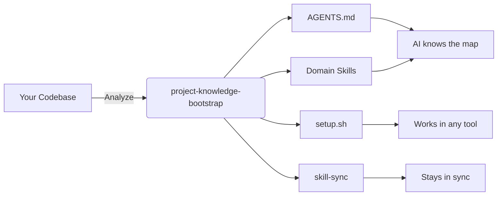
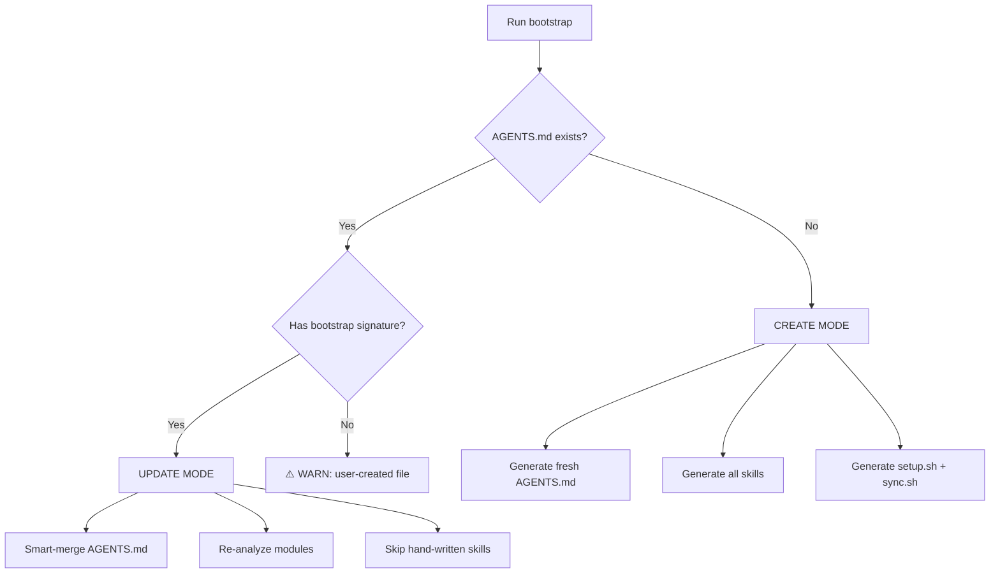
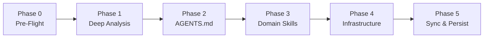

# 🧠 project-knowledge-bootstrap

> **Eliminate the AI cold-start problem.** Generate `AGENTS.md` + domain skills for any project in seconds.

[](https://opensource.org/licenses/MIT)
[]()
[]()
[](./CONTRIBUTING.md)

---

## 🎯 The Problem

Every time an AI agent opens your codebase, it starts **blind**. It doesn't know:

- What framework you use
- Where business logic lives
- What conventions MUST be followed
- Which patterns are sacred

You waste precious context window — and money — rediscovering the obvious.

## ✨ The Solution

**`project-knowledge-bootstrap`** analyzes your entire codebase and generates:

1. **`AGENTS.md`** — A lightweight, glanceable project map (~100 lines)
2. **`skills/`** — Deep, module-specific domain knowledge for AI agents
3. **`setup.sh`** — One-command installer for Claude, Cursor, Copilot, Gemini, and OpenCode
4. **`skill-sync/`** — Auto-updates the "auto-invoke" tables as skills evolve



---

## 🚀 What Gets Generated

### `AGENTS.md` — The Map

A single file at project root. Glanceable. Never over 150 lines.

```markdown
<!-- Generated by project-knowledge-bootstrap v1.0 -->

# My Project

## Stack

Next.js 14, React 18, TypeScript 5, Zustand 5, TanStack Query 5

## Architecture

Feature-based architecture: Page > View > Section > Component

## Modules

| Module   | Path          | Description         | Skill           |
| -------- | ------------- | ------------------- | --------------- |
| App Core | `app/`        | Pages, hooks, utils | `myproject-app` |
| UI       | `components/` | Reusable UI         | `myproject-ui`  |

## Critical Rules

- ALWAYS use React Query for data fetching
- NEVER put business logic in page components
- ALWAYS check permissions before actions
```

### `skills/` — The Territory

One skill per module. Real file paths. Real code snippets. Real commands.

```
skills/
├── myproject-overview/
│   └── SKILL.md          # Global architecture + conventions
├── myproject-api/
│   └── SKILL.md          # Deep knowledge for the API module
├── myproject-ui/
│   └── SKILL.md          # Components, styling, translations
└── setup.sh              # Multi-tool installer
```

---

## 🔄 Create vs Update Mode

The skill is **idempotent**. It detects existing artifacts and switches modes automatically.



| Mode       | AGENTS.md               | Generated Skills    | Hand-written Skills |
| ---------- | ----------------------- | ------------------- | ------------------- |
| **CREATE** | Generate fresh          | Generate all        | N/A                 |
| **UPDATE** | Smart-merge per section | Re-analyze & update | **NEVER touched**   |

---

## 📋 The 5 Phases



### Phase 0 — Pre-Flight

Detects existing artifacts. Determines **CREATE** or **UPDATE** mode. Warns if the user already has a hand-written `AGENTS.md`.

### Phase 1 — Deep Analysis

- Tech stack detection (Node, Go, Python, Rust, Java, .NET, Elixir, Ruby)
- Architecture pattern detection (monorepo, layered, Go standard, etc.)
- Module structure analysis
- Conventions, linting, testing, CI/CD detection
- Git conventions (conventional commits, branch strategy)
- Critical business rule extraction

### Phase 2 — Generate `AGENTS.md`

A lightweight map with Stack, Architecture, Modules, Available Skills, Auto-invoke rules, Critical Rules, and Development commands.

### Phase 3 — Generate Domain Skills

One skill per significant module. Each skill contains:

- Real directory structure
- Key patterns with actual code snippets
- Decision trees
- Module-specific critical rules
- Testing strategy
- Common commands

### Phase 4 — Generate Infrastructure

- `setup.sh` — multi-environment installer
- `skill-sync/assets/sync.sh` — auto-invoke table generator

### Phase 5 — Sync & Persist

Runs sync, saves a summary to Engram memory, and outputs the Bootstrap Report.

---

## 🛠 Installation

### Via skills.sh Ecosystem (Recommended)

This skill is part of the **open agent skills ecosystem** at [skills.sh](https://skills.sh). It requires zero registration — just run:

```bash
# Global (recommended): available in ALL projects
npx skills add alvarorestrepo/project-knowledge-bootstrap -g --all -y

# Per-project: available only in the current directory
npx skills add alvarorestrepo/project-knowledge-bootstrap --all -y
```

The `skills` CLI auto-detects **45+ AI agents** (Claude, Cursor, OpenCode, Gemini, Copilot, Cline, Codex, Windsurf, and more) and installs the skill to each one automatically.

#### Where it gets installed

| Scope       | Example Path                                                                 |
| ----------- | ---------------------------------------------------------------------------- |
| **Global**  | `~/.config/opencode/skills/`, `~/.claude/skills/`, `~/.cursor/skills/`, etc. |
| **Project** | `./.agents/skills/`, `./.claude/skills/`, `./.cursor/skills/`, etc.          |

### Generated Setup Scripts Usage

After the bootstrap runs on your project, it generates cross-platform setup scripts that configure `AGENTS.md` + skills across all AI tools.

#### macOS / Linux / WSL / Git Bash

```bash
# Project-level setup (default)
./skills/setup.sh --all

# Global setup (available in all projects)
./skills/setup.sh --all --global

# Individual tools
./skills/setup.sh --claude      # Claude Code
./skills/setup.sh --cursor      # Cursor
./skills/setup.sh --copilot     # GitHub Copilot
./skills/setup.sh --gemini      # Gemini CLI
./skills/setup.sh --opencode    # OpenCode
```

> **Windows users in Git Bash / MSYS2 / Cygwin**: `setup.sh` automatically detects Windows and uses **file copies** instead of symlinks (symlinks require admin privileges on Windows).

#### Windows PowerShell / CMD

```powershell
# Project-level setup (default)
.\skills\setup.ps1 -All

# Global setup (available in all projects)
.\skills\setup.ps1 -All -Global

# Individual tools
.\skills\setup.ps1 -Claude     # Claude Code
.\skills\setup.ps1 -Cursor     # Cursor
.\skills\setup.ps1 -Copilot    # GitHub Copilot
.\skills\setup.ps1 -Gemini     # Gemini CLI
.\skills\setup.ps1 -OpenCode   # OpenCode
```

### 🏆 Leaderboard & Discovery

You do **not** need to submit this skill to [skills.sh](https://skills.sh). Because it's a public GitHub repo with a valid `SKILL.md`, it is already discoverable and installable.

- **To climb the leaderboard**: encourage others to install it. Rankings are based on anonymous telemetry from the `skills` CLI.
- **Official badge**: the "Official" badge on skills.sh is reserved for curated skills from recognized organizations (e.g., `vercel-labs`, `anthropics`, `microsoft`). If you believe this skill should be considered, open a discussion in the [vercel-labs/skills](https://github.com/vercel-labs/skills) repo.

---

## 🎨 Example Output

### Bootstrap Report (CREATE Mode)

```markdown
## Bootstrap Report

**Mode**: CREATE
**Project**: adc-directa-2.0
**Timestamp**: 2026-03-30T17:35:00Z

### Created

- `AGENTS.md` — 112 lines, 6 modules
- `skills/adc-overview/SKILL.md` — 195 lines
- `skills/adc-data-layer/SKILL.md` — 210 lines
- `skills/adc-feature-modules/SKILL.md` — 230 lines
- `skills/adc-ui-components/SKILL.md` — 180 lines
- `skills/adc-config/SKILL.md` — 165 lines
- `skills/setup.sh` — multi-env installer
- `skills/skill-sync/assets/sync.sh` — auto-invoke sync

### Analysis Summary

**Stack**: Next.js 14, React 18, TypeScript 5, PrimeReact 10, Zustand 5, TanStack Query 5
**Architecture**: Feature-based: Page > View > Section > Component
**Modules**: 6 detected, 5 skills generated
**Conventions**: ESLint, Prettier, Jest, Playwright
**Git**: Conventional commits, GitHub Flow

### Critical Rules Extracted

1. ALWAYS use React Query for ALL data fetching
2. NEVER put business logic in page components
3. ALWAYS use HTTPRequest.get/post/put/patch/delete
4. ALWAYS gate React Query hooks with `enabled` option
5. ALWAYS add translations for ALL user-facing text
```

---

## 📁 Repository Structure

```
project-knowledge-bootstrap/
├── SKILL.md                    # The full skill specification
├── assets/
│   ├── AGENTS-TEMPLATE.md      # Template for AGENTS.md
│   ├── SKILL-TEMPLATE.md       # Template for domain skills
│   ├── setup.sh                # Unix installer (Bash 3+)
│   ├── setup.ps1               # Windows installer (PowerShell)
│   └── sync.sh                 # Auto-invoke sync script template
├── README.md                   # This file
└── LICENSE                     # MIT License
```

---

## 🧩 Compatibility

| AI Tool            | Skills              | Rules File                        | Supported |
| ------------------ | ------------------- | --------------------------------- | --------- |
| **Claude Code**    | `.claude/skills/`   | `CLAUDE.md`                       | ✅        |
| **Cursor**         | `.cursor/skills/`   | `.cursorrules`                    | ✅        |
| **OpenCode**       | `.opencode/skills/` | `AGENTS.md`                       | ✅        |
| **Gemini CLI**     | `.gemini/skills/`   | `GEMINI.md`                       | ✅        |
| **GitHub Copilot** | —                   | `.github/copilot-instructions.md` | ✅        |

---

## 🤝 Contributing

We love thoughtful contributions! Whether it's a bug fix, a new framework detection, or improved documentation, your help makes this skill better for everyone.

**Before you start:**

1. 📖 Read the [**Contributing Guide**](./CONTRIBUTING.md) — it explains our philosophy, commit conventions, and how to test your changes.
2. 📜 Review the [**Code of Conduct**](./CODE_OF_CONDUCT.md) — be kind, be constructive.
3. 🔍 Check existing [Issues](https://github.com/alvarorestrepo/project-knowledge-bootstrap/issues) and [Discussions](https://github.com/alvarorestrepo/project-knowledge-bootstrap/discussions).

> **Contribuciones bien pensadas > contribuciones rápidas.**

---

## ⚖️ Philosophy

> **AGENTS.md is the MAP, skills are the TERRITORY.**

The map should be **glanceable**. The territory should be **deep**. Don't duplicate — if it's in a module skill, don't bloat `AGENTS.md` with it.

---

## 📜 License

MIT © alvarorestrepo

---

<p align="center">
  <i>Made with 💜 for AI-first development workflows.</i>
</p>
